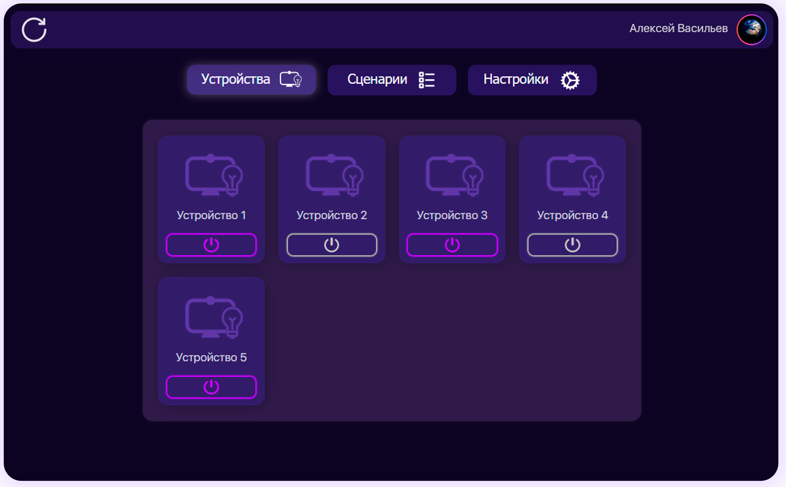

<h1>Smart Home</h1>

**Project by Alexey Vasiliev**
**([\@mrvasil](https://t.me/mrvasil))**

**[Git-repo with interface](https://github.com/mrvasil/smart-home-interface)**

  

**Description**: A desktop Windows application for managing smart
devices from **Yandex**, similar in interface and capabilities
to the mobile application ["Дом с Алисой"](https://apps.apple.com/ru/app/%D0%B4%D0%BE%D0%BC-%D1%81-%D0%B0%D0%BB%D0%B8%D1%81%D0%BE%D0%B9/id1582810683)

**Relevance:** At the moment, Yandex offers only a mobile version of the application (IOS, Android) for managing smart home devices. My project

allows you to control devices from a computer, and in the future, a
web version of the application may be developed.

**Application functions:**

> ● View all connected devices
>
> ● Turning on/off some devices
>
> ● Launching scenarios (executing commands by time/events) and more

**Technologies:**

> ● Yandex OAuth 2.0, Yandex API
> [(IOT)](https://yandex.ru/dev/dialogs/smart-home/doc/concepts/platform-protocol.html)
>
> ● Python (CustomTkinter and a few others) - frontend (client part)
> ● Python (several different libraries for connecting with API,
>
> the main one is requests) - backend (client part)
>
> ● Python (Flask, requests, etc.) - authorization (server part) 
>
> ● Windows - OS
>
> ● Auto-py-to-exe, Pyinstaller, Inno setup compiler - exe file and
> installer

**Plans:**

> ● Rewrite the interface in HTML, as
> current libraries are slow and inconvenient for use in
> development
>
> ● Add support for a larger number of device types (now
> some devices are displayed without the possibility
>
> of turning on/off and setting, and therefore without the option
> of control) ● Add functions that increase the convenience of use
>
> (for example: add division of devices into groups. Now all
> devices are displayed separately)
>
> ● Build the project for Linux, MacOS(?)

<h2>Interface:</h2>

[**Video**](https://drive.google.com/file/d/1JX4j8V-7iblz9bi7WjmRfu32kN0pBvoW/view?usp=sharing)
of work

**Screenshot of the current version of the interface:**

**New interface:**

**Feedback and questions :D -**
[**\@mrvasil**](https://t.me/mrvasil)

    

**Beautiful poster:**
